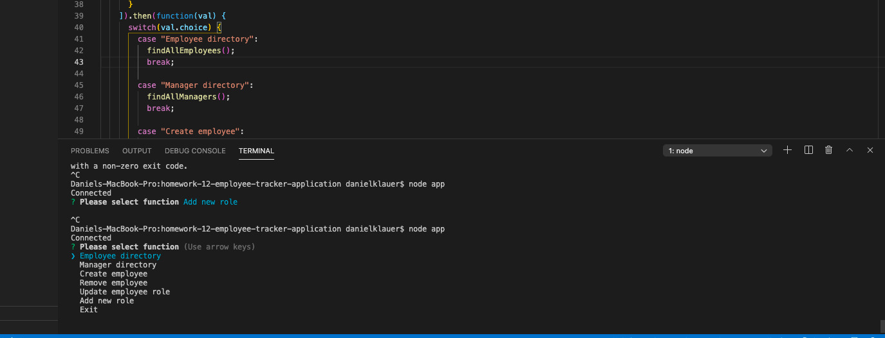

# homework-12-employee-tracker-application

Employee tracker app that allows the user to update, add, and delete employee, manager, and role information. This application uses a MySQL database and node for functionality. 

